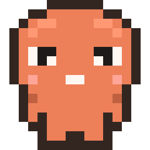
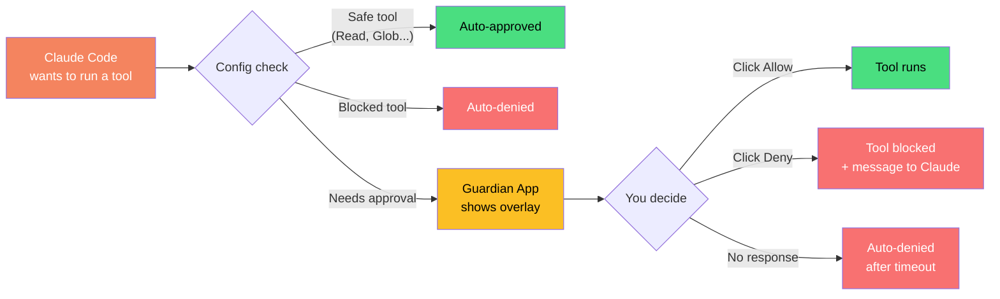
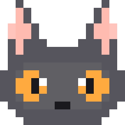
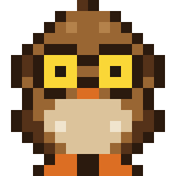
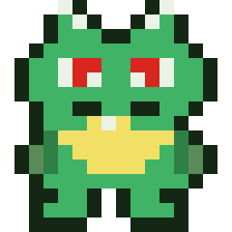

<p align="center">
  
</p>

<h1 align="center">Claude Guardian</h1>

<p align="center">
  <em>A living mascot that floats above your windows, guards your Claude Code sessions, and lets you approve or deny actions without leaving your flow.</em>
</p>

<p align="center">
  <strong>v2.0 — now includes built-in Claude Code analytics dashboard</strong>
</p>

---

Each terminal session gets its own mascot — every active session spawns an independent mascot on screen, handling its own permission requests. Click the menubar icon to see live usage stats, costs, token breakdowns, and trends.

## How It Works



## Install

### Homebrew (recommended)

```bash
brew tap anshaneja5/tap
brew install --cask claudeguardian
```

This installs the app to `/Applications/`, sets up Claude Code hooks, copies the default config to `~/.config/claude-guardian/`, and launches Guardian automatically.

> **macOS Gatekeeper note:** Since the app isn't notarized, macOS may show "app is damaged" or block it on first launch. Run this once to fix it:
> ```bash
> xattr -cr /Applications/ClaudeGuardian.app
> ```
> Then open the app normally. You only need to do this once.

### Upgrading

```bash
brew update
brew upgrade --cask claudeguardian
```

### From Source

```bash
git clone https://github.com/anshaneja5/Claude-Guardian.git
cd Claude-Guardian
./setup.sh
```

This will:
1. Build the `.app` bundle
2. Install `PreToolUse`, `SessionStart`, `SessionEnd`, `PermissionRequest`, and `Notification` hooks into `~/.claude/settings.json`
3. Copy the default config to `~/.config/claude-guardian/guardian.config.json`
4. Create a LaunchAgent so Guardian starts on login
5. Launch the app

### Manual Start

```bash
# Build
cd app/ClaudeGuardian
swiftc -o ClaudeGuardian Sources/main.swift Sources/sprites.swift \
    -framework Cocoa -framework SwiftUI -framework Network

# Run
./ClaudeGuardian &
```

## Features

### Analytics Dashboard (v2)
Click the menubar icon → **Stats** tab to see a full analytics dashboard powered by your local `~/.claude/` data:
- **Today** — cost, sessions, messages, tokens, token breakdown by type, rate limits (5-hour & 7-day), recent sessions
- **All Time** — lifetime totals, average daily cost, active days, model breakdown (Opus/Sonnet/Haiku)
- **Projects** — cost ranked by project with visual progress bars
- **Trends** — 7-day cost chart + 30-day daily history table
- Auto-syncs on file changes, 100% local — no data leaves your machine

### Bypass Permissions Mode
- When running `claude --dangerously-skip-permissions`, Guardian steps aside completely — no mascot, no overlay, total silence
- Set `"notify_only": true` in `~/.config/claude-guardian/guardian.config.json` to always run in this mode
- Tools already allowed in Claude Code's own `settings.json` / `settings.local.json` are also auto-approved silently

### Multi-Session Support
- Each Claude Code session gets its **own mascot widget** on screen
- Mascots appear when a session starts, disappear when it ends
- Each widget is **independently draggable** — place them wherever you want
- Each widget shows the **project folder name** so you know which session is which
- Permission requests are routed to the correct session's mascot
- No sessions running = no mascots on screen (just the menubar icon)

### Mascot Interactions
- **Click** a mascot to **jump to that session's terminal** — instantly focuses the right window
- **Long press** (hold 0.5s) to **cycle through mascot styles** — each session can have a different mascot
- **Resize** with the `+` / `-` buttons in the bottom-right corner — scales the entire widget (mascot, text, box)
- The `mascot` field in config sets the default for new sessions

### Animated Pixel Art
- Animations change based on state:
  - **Idle**: breathing + blinking cycle
  - **Permission pending**: waving / ear wiggle
  - **Approved**: happy expression (^_^)
  - **Denied**: sad expression with droopy ears
- Status label below each mascot: **IDLE**, **WORKING**, **NEEDS YOU**, **APPROVED!**, **DENIED**

### Sound Effects
- **Permission needed** → submarine alert sound so you never miss it
- **Approved** → pop sound
- **Denied** → basso sound
- **Timeout** → sosumi sound
- **Notification** → blow sound
- All using macOS built-in system sounds — no extra files needed

### Notification Bubbles
- Claude's notifications appear as **speech bubbles** above the mascot
- Shows messages like "Task completed", errors, or status updates
- Auto-dismisses after 5 seconds, or tap to dismiss immediately
- Widget expands to fit the message text

### Live Session Cost
- Displays the running cost (USD) of each session right on the mascot widget
- Updates automatically every time Claude uses a tool
- Keeps you aware of spend without checking the terminal

### Permission Panel
- Expands below the mascot when Claude needs approval
- Shows the **tool type** (Shell Command, Write File, Edit File, etc.)
- Shows the **exact content** — the command, file path, code changes, etc.
- **Allow** button (or press **Enter**) to approve
- **Deny** button (or press **Esc**) to reject
  - Click Deny once to reveal a text field where you can type a message back to Claude (e.g. "don't delete that, use X instead")
  - Click "Send & Deny" to send the message and reject
- Countdown timer — auto-denies after timeout (default 300 seconds)
- Panel collapses back to just the mascot after you respond

### Menu Bar
- Status icon in the macOS menu bar: 🟢 no sessions, 🟠 active, 🔴 needs attention, ✅ just approved, ❌ just denied
- Click the icon to see:
  - **Active sessions** with **Hide/Show** buttons — hide a mascot if you don't need it for that session
  - Session cost and project name at a glance
  - Approve/deny stats
  - Searchable action history log (last 50 actions)
  - Filter bar to search by tool name or content
  - Quit button

### Don't want the mascot for a session?
1. Click the menubar icon (green/orange/red dot at the top of your screen)
2. Find the session → click **Hide**
3. That mascot disappears and the session falls back to normal Claude Code terminal permissions
4. Click **Show** anytime to bring it back

### Fallback Behavior
- If the Guardian app isn't running, the hook exits silently and Claude Code falls back to its own built-in permission prompts
- No action is ever silently approved — if something goes wrong, it fails safe

## Configuration

Edit `~/.config/claude-guardian/guardian.config.json` (created during setup):

```json
{
  "port": 9001,
  "timeout_seconds": 300,
  "mascot": "cat",
  "auto_approve": ["Read", "Glob", "Grep", "LS"],
  "always_block": [],
  "ask": ["Bash", "Write", "Edit", "NotebookEdit"]
}
```

| Field | Description |
|-------|-------------|
| `port` | HTTP port for hook-to-app communication (default `9001`) |
| `timeout_seconds` | Auto-deny after this many seconds of no response (default `300`) |
| `mascot` | Default mascot for new sessions (can be changed per-session by clicking) |
| `auto_approve` | Tool names that pass through without asking |
| `always_block` | Tool names that are always denied |
| `ask` | Tool names that show the permission overlay |

### Mascots

Set `"mascot"` in config for the default, or **click any mascot on screen** to cycle through them live:

| `"claude"` | `"cat"` | `"owl"` | `"skull"` | `"dog"` | `"dragon"` |
|:-:|:-:|:-:|:-:|:-:|:-:|
|  |  |  |  |  |  |
| Coral Claude | Dark Gray Cat | Brown Owl | Pixel Skull | Golden Puppy | Green Dragon |

## Architecture

### Hooks (installed in `~/.claude/settings.json`)
| Hook | Script | Purpose |
|------|--------|---------|
| `PreToolUse` | `hook/pre_tool_use.py` | Intercepts tool calls, blocks until user approves/denies |
| `PermissionRequest` | `hook/permission_request.py` | Intercepts built-in "Yes/No" permission prompts |
| `SessionStart` | `hook/session_lifecycle.py` | Notifies Guardian to spawn a mascot |
| `SessionEnd` | `hook/session_lifecycle.py` | Notifies Guardian to remove the mascot |
| `Notification` | `hook/notification.py` | Forwards notifications as speech bubbles on mascot |

### Swift App (`app/ClaudeGuardian/Sources/`)
- **`main.swift`**: App delegate with per-session window management, HTTP server (NWListener), SwiftUI views, menubar
- **`sprites.swift`**: All pixel art mascot sprites (16x16 grids) with animation frames and color palettes
- Runs as a menubar-only app (no Dock icon)
- HTTP server handles `/health`, `/request`, `/session`, and `/decision/{id}` endpoints
- Each session window uses `.screenSaver` level to appear above fullscreen apps

## File Structure

```
claude-guardian/
├── setup.sh                              # One-command install (build + post-install)
├── build-app.sh                          # Builds ClaudeGuardian.app bundle + zip
├── post-install.sh                       # Installs hooks, config, launch agent
├── guardian.config.json                   # Default config (port, timeout, mascot, rules)
├── hook/
│   ├── pre_tool_use.py                   # PreToolUse hook (blocks until decision)
│   ├── permission_request.py             # PermissionRequest hook (built-in Yes/No prompts)
│   ├── session_lifecycle.py              # SessionStart/SessionEnd hook (fire-and-forget)
│   └── notification.py                   # Notification hook (speech bubbles)
├── app/
│   └── ClaudeGuardian/
│       ├── Info.plist                    # macOS app bundle metadata
│       └── Sources/
│           ├── main.swift                # App, HTTP server, per-session windows, UI
│           └── sprites.swift             # Pixel art mascot sprite data
├── homebrew/
│   └── claudeguardian.rb                 # Homebrew cask formula
├── .github/
│   └── workflows/
│       └── release.yml                   # CI: build + GitHub release on tag push
├── assets/                               # Generated mascot preview images
│   ├── claude.png
│   ├── cat.png
│   ├── owl.png
│   ├── skull.png
│   ├── dog.png
│   └── dragon.png
├── generate_pngs.py                      # Script to regenerate mascot PNGs from sprites
└── README.md
```

## Requirements

- macOS 13+ (Ventura or later)
- Swift 5.9+ (included with Xcode or Xcode Command Line Tools)
- Python 3 (pre-installed on macOS)
- Claude Code CLI with hooks support

## Uninstall

### If installed via Homebrew

```bash
brew uninstall --cask claudeguardian
```

This automatically stops the app, removes hooks from `~/.claude/settings.json`, and cleans up the launch agent.

### If installed from source

```bash
./uninstall.sh
```

Or manually:

```bash
# 1. Stop the running app
pkill -f ClaudeGuardian

# 2. Remove the launch agent
launchctl unload ~/Library/LaunchAgents/com.claudeguardian.app.plist
rm ~/Library/LaunchAgents/com.claudeguardian.app.plist

# 3. Remove hooks from Claude Code settings
# Edit ~/.claude/settings.json and delete PreToolUse, SessionStart, SessionEnd,
# PermissionRequest, and Notification hook entries

# 4. Remove config and project folder
rm -rf ~/.config/claude-guardian
rm -rf /path/to/claude-guardian
```

## Keyboard Shortcuts

| Action | What it does |
|--------|-------------|
| `Enter` / `Return` | Allow the pending action |
| `Escape` | Deny (first press reveals message field, second press sends) |
| Click mascot | Jump to that session's terminal |
| Long press mascot | Cycle to next mascot style |
| Click `+` / `-` | Resize the widget (scales everything) |
| Menubar → Hide | Dismiss mascot for that session (uses normal terminal flow) |
| Menubar → Show | Bring the mascot back |

## Troubleshooting

**Hook error about spaces in path**: If your project folder path contains spaces, make sure the hook command in `~/.claude/settings.json` wraps the script path in single quotes:
```json
"command": "python3 '/path/with spaces/hook/pre_tool_use.py'"
```

**Overlay doesn't appear**: Check that the Guardian app is running (`curl http://localhost:9001/health` should return `{"status":"ok"}`). If not, launch it manually.

**Port conflict**: If port 9001 is taken, change `"port"` in both `guardian.config.json` and the hook scripts' `GUARDIAN_PORT` variable.

**Mascot doesn't appear for a session**: Make sure `SessionStart` and `SessionEnd` hooks are installed in `~/.claude/settings.json`. Run `./setup.sh` again to reinstall all hooks.

## Credits

- Cat pixel art sprites based on "Cats - Pixel Art" by peony ([OpenGameArt](https://opengameart.org), CC-BY 4.0)
