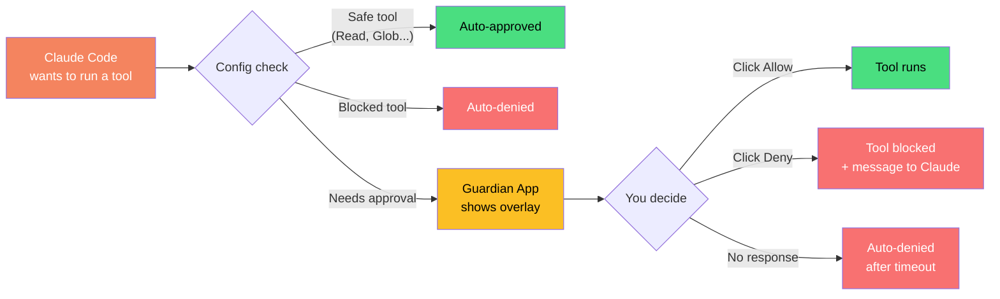

<p align="center">
  
</p>

<h1 align="center">Claude Guardian</h1>

<p align="center">
  <em>A living mascot that floats above your windows, guards your Claude Code sessions, and lets you approve or deny actions without leaving your flow.</em>
</p>

---

Each terminal session gets its own mascot — every active session spawns an independent mascot on screen, handling its own permission requests.

## How It Works



## Quick Start

```bash
./setup.sh
```

This will:
1. Compile the Swift app
2. Install `PreToolUse`, `SessionStart`, and `SessionEnd` hooks into `~/.claude/settings.json`
3. Create a LaunchAgent so Guardian starts on login
4. Launch the app

### Manual Start

```bash
# Build
cd app/ClaudeGuardian
swiftc -o ClaudeGuardian Sources/main.swift Sources/sprites.swift \
    -framework Cocoa -framework SwiftUI -framework Network

# Run
./ClaudeGuardian &
```

## Features

### Multi-Session Support
- Each Claude Code session gets its **own mascot widget** on screen
- Mascots appear when a session starts, disappear when it ends
- Each widget is **independently draggable** — place them wherever you want
- Each widget shows the **project folder name** so you know which session is which
- Permission requests are routed to the correct session's mascot
- No sessions running = no mascots on screen (just the menubar icon)

### Clickable Mascots
- **Click any mascot to cycle through all 6 mascot styles**
- Each session can have a different mascot — cat for your API project, dragon for your frontend
- The `mascot` field in config sets the default for new sessions

### Animated Pixel Art
- Animations change based on state:
  - **Idle**: breathing + blinking cycle
  - **Permission pending**: waving / ear wiggle
  - **Approved**: happy expression (^_^)
  - **Denied**: sad expression with droopy ears
- Status label below each mascot: **IDLE**, **WORKING**, **NEEDS YOU**, **APPROVED!**, **DENIED**

### Permission Panel
- Expands below the mascot when Claude needs approval
- Shows the **tool type** (Shell Command, Write File, Edit File, etc.)
- Shows the **exact content** — the command, file path, code changes, etc.
- **Allow** button (or press **Enter**) to approve
- **Deny** button (or press **Esc**) to reject
  - Click Deny once to reveal a text field where you can type a message back to Claude (e.g. "don't delete that, use X instead")
  - Click "Send & Deny" to send the message and reject
- Countdown timer — auto-denies after timeout (default 300 seconds)
- Panel collapses back to just the mascot after you respond

### Menu Bar
- Status icon in the macOS menu bar: 🟢 no sessions, 🟠 active, 🔴 needs attention, ✅ just approved, ❌ just denied
- Click the icon to see:
  - Active session count
  - Approve/deny stats
  - Searchable action history log (last 50 actions)
  - Filter bar to search by tool name or content
  - Quit button

### Fallback Behavior
- If the Guardian app isn't running, the hook exits silently and Claude Code falls back to its own built-in permission prompts
- No action is ever silently approved — if something goes wrong, it fails safe

## Configuration

Edit `guardian.config.json`:

```json
{
  "port": 9001,
  "timeout_seconds": 300,
  "mascot": "cat",
  "auto_approve": ["Read", "Glob", "Grep", "LS"],
  "always_block": [],
  "ask": ["Bash", "Write", "Edit", "NotebookEdit"]
}
```

| Field | Description |
|-------|-------------|
| `port` | HTTP port for hook-to-app communication (default `9001`) |
| `timeout_seconds` | Auto-deny after this many seconds of no response (default `300`) |
| `mascot` | Default mascot for new sessions (can be changed per-session by clicking) |
| `auto_approve` | Tool names that pass through without asking |
| `always_block` | Tool names that are always denied |
| `ask` | Tool names that show the permission overlay |

### Mascots

Set `"mascot"` in config for the default, or **click any mascot on screen** to cycle through them live:

| `"claude"` | `"cat"` | `"owl"` | `"skull"` | `"dog"` | `"dragon"` |
|:-:|:-:|:-:|:-:|:-:|:-:|
|  |  |  |  |  |  |
| Coral Claude | Dark Gray Cat | Brown Owl | Pixel Skull | Golden Puppy | Green Dragon |

## Architecture

### Hooks (installed in `~/.claude/settings.json`)
| Hook | Script | Purpose |
|------|--------|---------|
| `PreToolUse` | `hook/pre_tool_use.py` | Intercepts tool calls, blocks until user approves/denies |
| `SessionStart` | `hook/session_lifecycle.py` | Notifies Guardian to spawn a mascot |
| `SessionEnd` | `hook/session_lifecycle.py` | Notifies Guardian to remove the mascot |

### Swift App (`app/ClaudeGuardian/Sources/`)
- **`main.swift`**: App delegate with per-session window management, HTTP server (NWListener), SwiftUI views, menubar
- **`sprites.swift`**: All pixel art mascot sprites (16x16 grids) with animation frames and color palettes
- Runs as a menubar-only app (no Dock icon)
- HTTP server handles `/health`, `/request`, `/session`, and `/decision/{id}` endpoints
- Each session window uses `.screenSaver` level to appear above fullscreen apps

## File Structure

```
claude-guardian/
├── setup.sh                              # One-command install + build + launch
├── guardian.config.json                   # Runtime config (port, timeout, mascot, rules)
├── hook/
│   ├── pre_tool_use.py                   # PreToolUse hook (blocks until decision)
│   └── session_lifecycle.py              # SessionStart/SessionEnd hook (fire-and-forget)
├── app/
│   └── ClaudeGuardian/
│       └── Sources/
│           ├── main.swift                # App, HTTP server, per-session windows, UI
│           └── sprites.swift             # Pixel art mascot sprite data
├── assets/                               # Generated mascot preview images
│   ├── claude.png
│   ├── cat.png
│   ├── owl.png
│   ├── skull.png
│   ├── dog.png
│   └── dragon.png
├── generate_pngs.py                      # Script to regenerate mascot PNGs from sprites
└── README.md
```

## Requirements

- macOS 13+ (Ventura or later)
- Swift 5.9+ (included with Xcode or Xcode Command Line Tools)
- Python 3 (pre-installed on macOS)
- Claude Code CLI with hooks support

## Uninstall

```bash
# 1. Stop the running app
pkill -f ClaudeGuardian

# 2. Remove the launch agent
launchctl unload ~/Library/LaunchAgents/com.claudeguardian.app.plist
rm ~/Library/LaunchAgents/com.claudeguardian.app.plist

# 3. Remove hooks from Claude Code settings
# Edit ~/.claude/settings.json and delete PreToolUse, SessionStart, SessionEnd entries

# 4. Delete the project folder
rm -rf /path/to/claude-guardian
```

## Keyboard Shortcuts

| Key | Action |
|-----|--------|
| `Enter` / `Return` | Allow the pending action |
| `Escape` | Deny (first press reveals message field, second press sends) |
| Click mascot | Cycle to next mascot style |

## Troubleshooting

**Hook error about spaces in path**: If your project folder path contains spaces, make sure the hook command in `~/.claude/settings.json` wraps the script path in single quotes:
```json
"command": "python3 '/path/with spaces/hook/pre_tool_use.py'"
```

**Overlay doesn't appear**: Check that the Guardian app is running (`curl http://localhost:9001/health` should return `{"status":"ok"}`). If not, launch it manually.

**Port conflict**: If port 9001 is taken, change `"port"` in both `guardian.config.json` and the hook scripts' `GUARDIAN_PORT` variable.

**Mascot doesn't appear for a session**: Make sure `SessionStart` and `SessionEnd` hooks are installed in `~/.claude/settings.json`. Run `./setup.sh` again to reinstall all hooks.

## Credits

- Cat pixel art sprites based on "Cats - Pixel Art" by peony ([OpenGameArt](https://opengameart.org), CC-BY 4.0)
